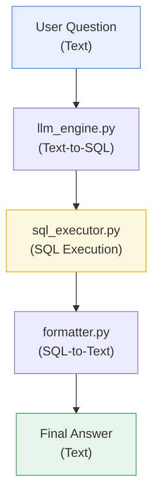

# Data QA Agent

A conversational agent that lets you query a dataset using natural language. It translates your questions into SQL queries using a local LLM (via [Ollama](https://ollama.com)), runs those queries against a SQLite database, and then rephrases the results into a clear, easy to understand answer no technical jargon.

The project is built around the well-known **Superstore** dataset (sales, customers, products) and provides both a command-line interface and a Streamlit web app.

Dataset: [Superstore.csv on Kaggle](https://www.kaggle.com/datasets/binib1997/superstore?select=Superstore.csv)

## Features

- **Natural language questions**: ask questions the way you'd ask a person ("Which customer spent the most?")
- **Automatic SQL generation**: an LLM (llama3 via Ollama) translates the question into a SQL query matching the database schema
- **Safe execution**: queries are validated before execution: any write operation (`INSERT`, `UPDATE`, `DELETE`, `DROP`, `ALTER`, `CREATE`, `ATTACH`) is blocked, and the database is opened in read-only mode (`mode=ro`)
- **Natural-language answers**: raw query results are turned into one or two plain sentences by the LLM
- **Two interfaces**: an interactive command-line loop and a Streamlit web app

## Architecture

The agent operates through a modular three-step pipeline :



1. **`llm_engine.py`:** Translates raw user questions into optimized SQLite queries using a tailored *Few-Shot Prompting* technique driven by local **Llama 3** instances.
2. **`sql_executor.py`:** Acts as a security layer. It parses queries to block unauthorized keywords (`DROP`, `DELETE`, etc.) and safely executes read-only operations directly on the SQLite database using native *URI parameters*   (`mode=ro`).
3. **`formatter.py`:** Takes the raw tabular data (tuples) from SQLite and commands the LLM to format it into a concise, jargon-free business answer, preventing model "yapping."


## Installation

### Prerequisites

- Python 3.9+
- [Ollama](https://ollama.com) installed and running locally
- The `llama3` model pulled via Ollama:

```bash
ollama pull llama3
```

### Steps

1. Clone the repository:

```bash
git clone https://github.com/chadamaly/DATA-QA-AGENT.git
```

2. Install the dependencies:

```bash
pip install -r requirements.txt
```

3. Build the database from the CSV file (if needed):

```bash
python src/build_database.py
```

## Usage

### Command-line interface

```bash
python src/main.py
```

### Web interface (Streamlit)

```bash
streamlit run app/streamlit_app.py
```

